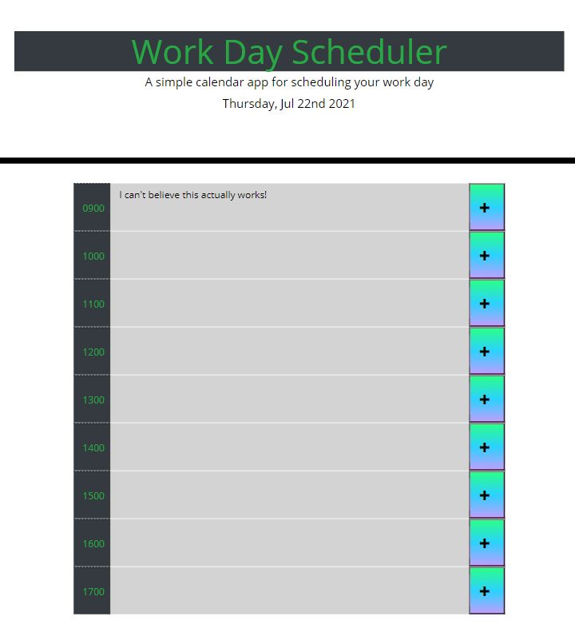

# Work Day Scheduler 

Download starter code from Git repository: coding-boot-camp / super-disco
Create a daily planner web application that allows employees to add important events and manage their time effectively. 

## Requirements

* When the planner is opened, the current day is displayed at the top of the calendar.

* As the user scrolls down the page they are presented with time blocks for standard business hours.

* When the user views the time blocks for that day, each block is color-coded to indicate whether it is in the past, present, or future.

* When the user clicks a time block they are able to enter an event that can be saved, and the text can for that event is saved in local storage.

* When the page is refreshed the saved events persist.

## Deployed Application Link

https://ratalla816.github.io/workday-scheduler/

## Deployed Application Screenshot

#### acknowledgements

* Web APIs Challenge: Work Day Scheduler - KU Coding Bootcamp, Module 5 Challenge Assignment © 2021 Trilogy Education Services, LLC, a 2U, Inc. 
brand Confidential and Proprietary. All Rights Reserved.

* Taskmaster-Pro: KU Coding Bootcamp, Module 5 Activity © 2021 Trilogy Education Services, LLC, a 2U, Inc. brand. Confidential and Proprietary. All Rights Reserved.

#### MIT License

Copyright (c) 2021 Rob Christopher Atalla

Permission is hereby granted, free of charge, to any person obtaining a copy of this software and associated documentation files (the "Software"), to deal in the Software without restriction, including without limitation the rights to use, copy, modify, merge, publish, distribute, sublicense, and/or sell copies of the Software, and to permit persons to whom the Software is furnished to do so, subject to the following conditions:

The above copyright notice and this permission notice shall be included in all copies or substantial portions of the Software.

THE SOFTWARE IS PROVIDED "AS IS", WITHOUT WARRANTY OF ANY KIND, EXPRESS OR IMPLIED, INCLUDING BUT NOT LIMITED TO THE WARRANTIES OF MERCHANTABILITY, FITNESS FOR A PARTICULAR PURPOSE AND NONINFRINGEMENT. IN NO EVENT SHALL THE AUTHORS OR COPYRIGHT HOLDERS BE LIABLE FOR ANY CLAIM, DAMAGES OR OTHER LIABILITY, WHETHER IN AN ACTION OF CONTRACT, TORT OR OTHERWISE, ARISING FROM, OUT OF OR IN CONNECTION WITH THE SOFTWARE OR THE USE OR OTHER DEALINGS IN THE SOFTWARE.
